# Three-Tier WordPress Deployment on AWS with Terraform

## Scenario — What Problem Are We Solving?

This project simulates a real cloud migration scenario. A small business is running WordPress on an aging on-premise server with no redundancy, no automated backups, and no ability to handle traffic spikes. One hardware failure takes the entire site offline.

The goal was to move that workload to AWS using a three-tier architecture: a load balancer tier, an application tier, and a database tier, defined entirely as Infrastructure as Code using Terraform. I'll be upfront: this was my first Terraform project. I had never written a .tf file before starting this. What you'll see here is not a clean run. It is a real build with real errors, real fixes, and documentation of every decision I made along the way.

---

## Architecture

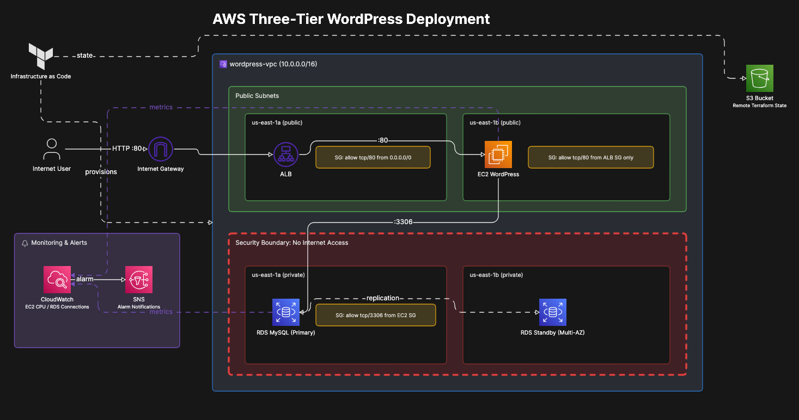

*Internet traffic enters through the ALB, routes to EC2 running WordPress in a public subnet, which connects to a private RDS MySQL database that has no path to the internet. Terraform state is stored remotely in S3.*

---

## AWS Services Used

- **Terraform** — Infrastructure as Code, the entire stack defined and deployed from code
- **Amazon VPC** — isolated network with public and private subnets across two availability zones
- **Amazon EC2** — application server running WordPress on Amazon Linux 2023
- **Amazon RDS MySQL 8.0** — managed database in a private subnet with no internet access
- **Application Load Balancer** — the only public entry point into the application
- **Amazon S3** — remote Terraform state storage with versioning enabled
- **Amazon CloudWatch** — EC2 CPU and RDS connection monitoring
- **Amazon SNS** — email alerting when CloudWatch thresholds are exceeded

---

## Obstacles — Constraints and Security Requirements

**The database must never be publicly accessible.**
A common mistake is placing RDS in a public subnet or enabling publicly_accessible = true. That exposes the database directly to the internet. The right approach is placing RDS in private subnets with no route to an internet gateway, reachable only from the EC2 application layer.

**Security groups must be chained, not open.**
Instead of allowing broad inbound access, the security groups are chained so the ALB only accepts port 80 from the internet, EC2 only accepts port 80 from the ALB and SSH from one specific IP, and RDS only accepts port 3306 from EC2. Nothing touches RDS from the internet, even indirectly.

**Terraform state must never live on a local machine.**
If the machine fails, the state file is gone and Terraform loses track of everything it built. Remote state stored in a private S3 bucket with versioning means previous versions can be recovered if anything gets corrupted. It also means multiple engineers can work from the same state file instead of having separate out of sync copies on individual machines.

**Sensitive values must never be committed to GitHub.**
Passwords and IP addresses live in terraform.tfvars which is blocked by .gitignore before anything gets pushed. This is enforced before the first commit, not as an afterthought.

---

## Actions — What Was Built and Why

### Step 1 — Environment Setup and Terraform Configuration

All work starts locally on my Mac. Terraform, the AWS CLI, and every project file live on my machine. EC2 and other AWS resources do not exist yet at this point. Terraform creates them.

I installed Terraform via Homebrew and verified the install before writing a single line of code.

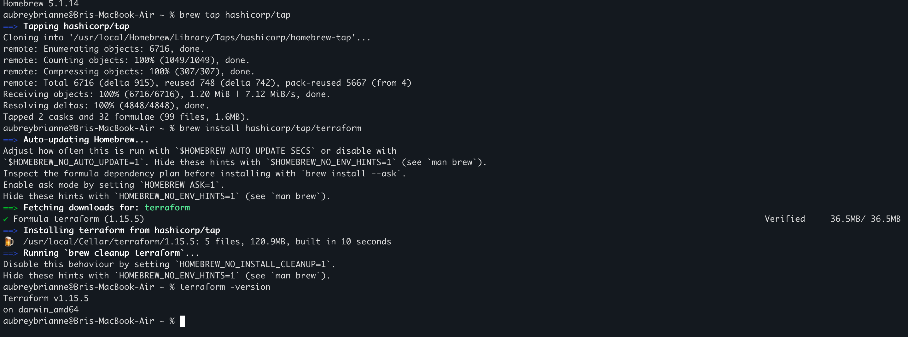

I created the project folder and all five Terraform configuration files, then opened everything in VS Code with the HashiCorp Terraform extension installed for syntax validation and highlighting.

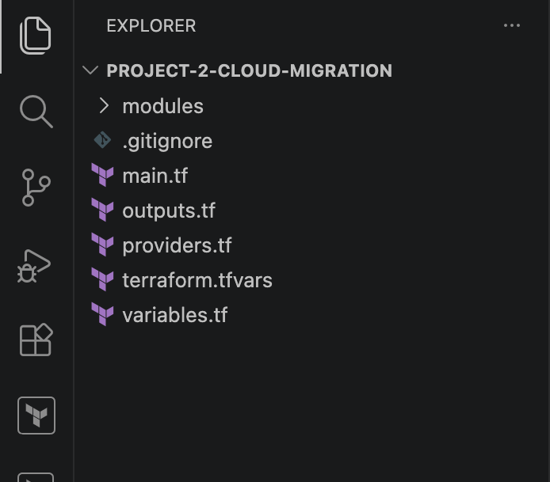

Here is what each file does and why it exists:

**providers.tf** tells Terraform three things: which cloud provider to use, what version of Terraform is required, and where to store the state file. This is the first file written because everything else depends on it being correct.

**variables.tf** defines placeholders for sensitive values like the database password and my IP address. Marking db_password as sensitive = true means Terraform will never print that value in terminal output, even during terraform plan or terraform apply.

**terraform.tfvars** is where those placeholders get filled in with real values. This file never gets committed to GitHub. It contains my actual password and home IP address and is blocked by .gitignore from day one.

**main.tf** is the core of the project. It defines every piece of infrastructure Terraform will build: the VPC, subnets, security groups, EC2 instance, load balancer, RDS database, CloudWatch alarms, and SNS topic. This is the file that turns code into real cloud infrastructure.

**outputs.tf** prints useful information to the terminal after terraform apply finishes: the ALB DNS name to test the site, the EC2 public IP for SSH, and the RDS endpoint marked sensitive so it never displays in plain text.

---

### Step 2 — Remote State S3 Bucket

Before running terraform init, I created the S3 bucket that stores Terraform state remotely. This has to be done manually because Terraform cannot create the bucket it needs to store its own state. It is a dependency that has to exist first.

Versioning was enabled on the bucket so previous state versions can be recovered if something gets corrupted.
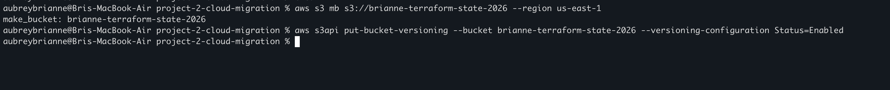

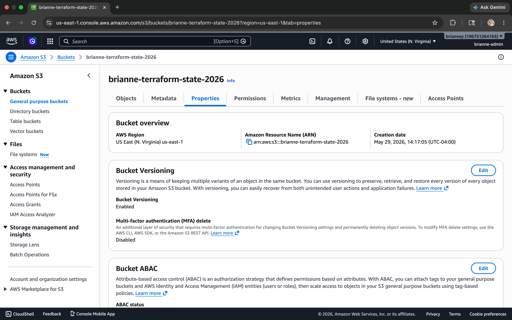

After terraform apply completed, the state file appeared inside the bucket at project-2/terraform.tfstate confirming the remote backend connected and worked correctly.

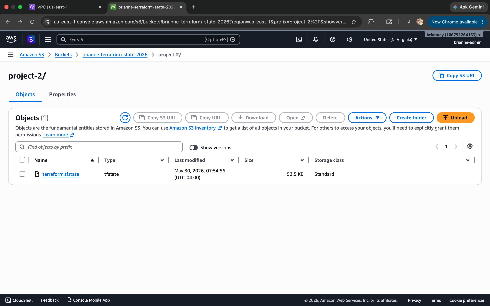

---

### Step 3 — Infrastructure Deployment with Terraform

With all five files written and the S3 backend in place, I ran terraform init to initialize Terraform, download the AWS provider plugin, and connect to the remote backend.

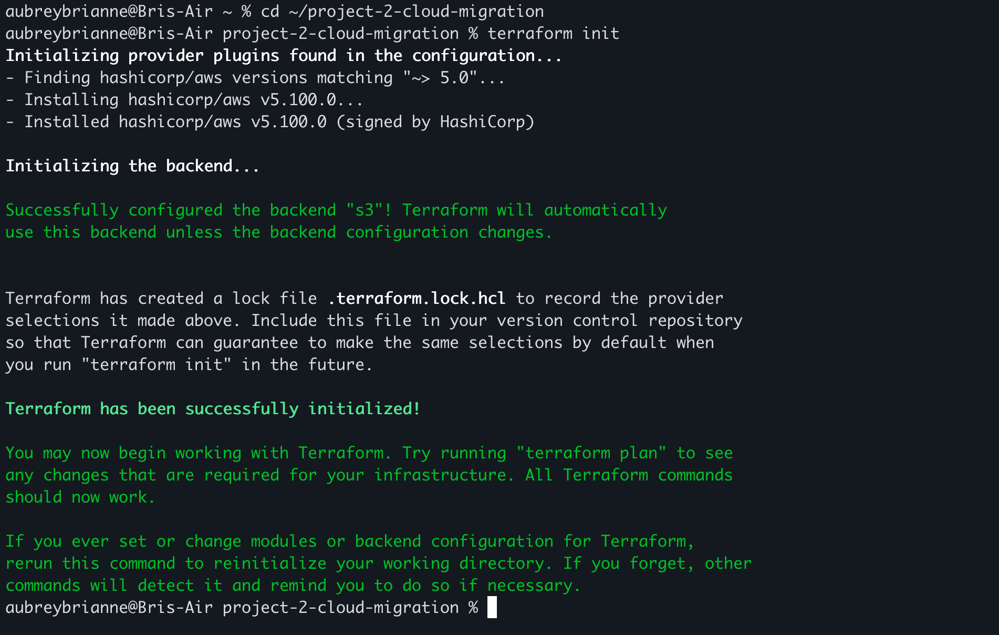

terraform plan validated 23 resources to be created across the full stack. Running terraform apply provisioned everything: VPC, subnets, internet gateway, route tables, security groups, EC2, ALB, target group, RDS, CloudWatch alarms, and SNS topic.

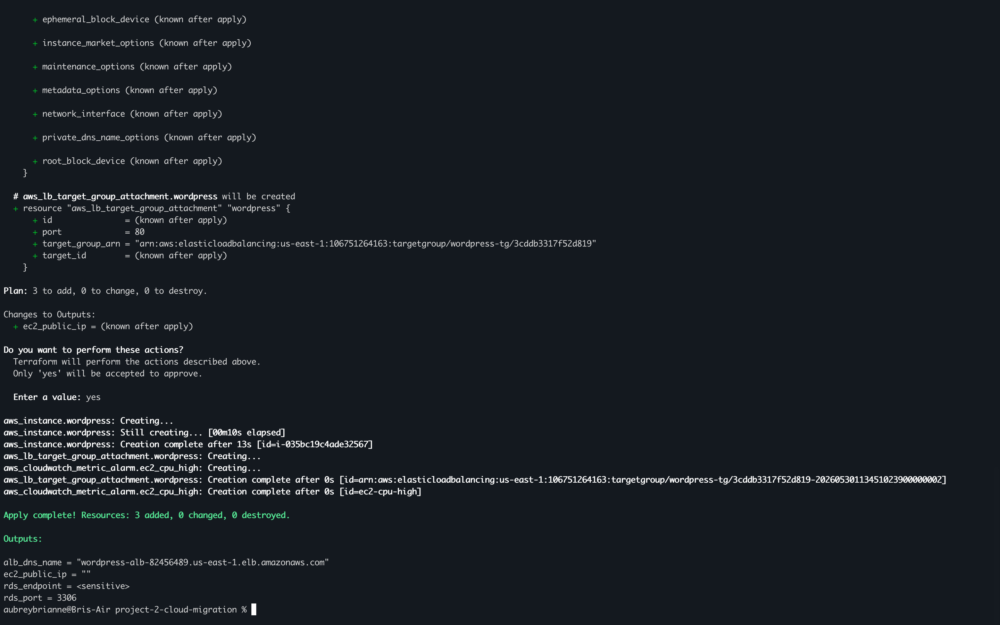

**VPC and Networking** — I built a VPC with CIDR 10.0.0.0/16 and four subnets across two availability zones. Two public subnets host the ALB and EC2. Two private subnets host RDS. Four subnets are required because AWS mandates that both the ALB and RDS span at least two availability zones for redundancy.

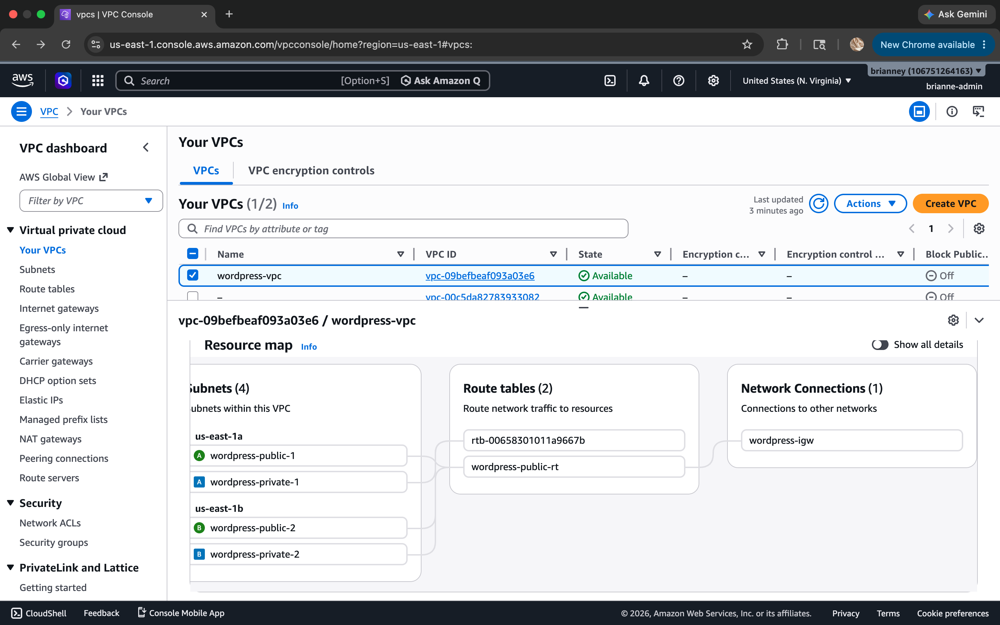

**Security Groups** — three chained security groups enforce least privilege at the network layer. The ALB accepts port 80 from the internet. EC2 accepts port 80 only from the ALB security group and SSH only from my IP. RDS accepts port 3306 only from the EC2 security group. Each rule references a security group ID rather than an IP range, which is more precise and automatically follows the resource if it changes.

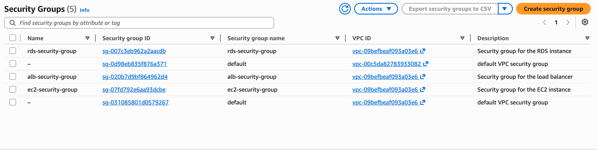

**EC2 and ALB** — I deployed the EC2 instance using the latest Amazon Linux 2023 AMI with a user_data script designed to install Apache, PHP, and WordPress automatically on first boot. The ALB was deployed across both public subnets with a target group that performs health checks before routing any traffic.

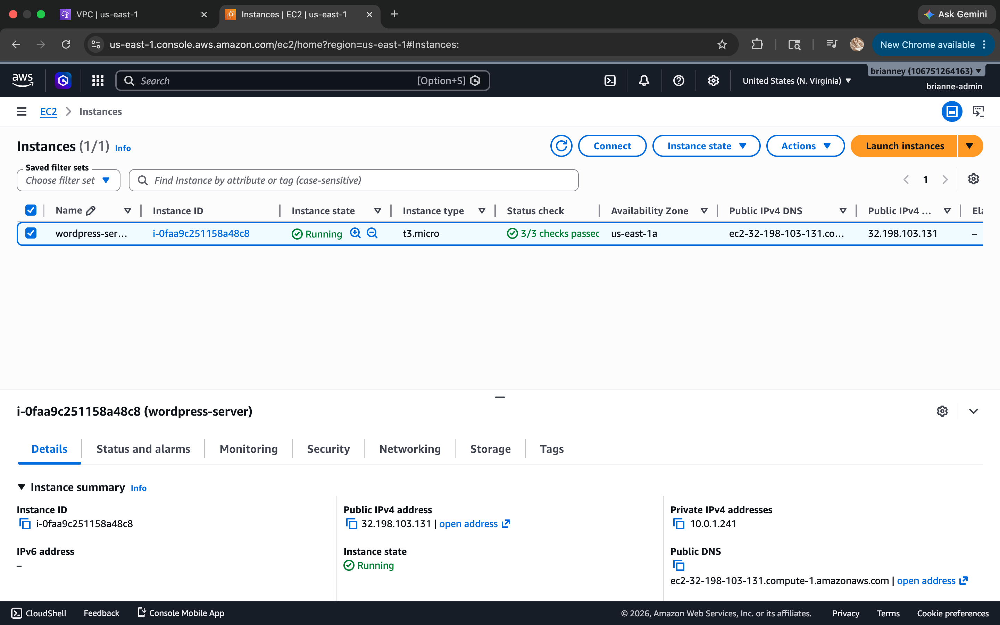

**RDS** — MySQL 8.0 on db.t3.micro deployed in a private DB subnet group spanning both private subnets. publicly_accessible is set to false at the resource level, meaning even a subnet misconfiguration would not expose the database.

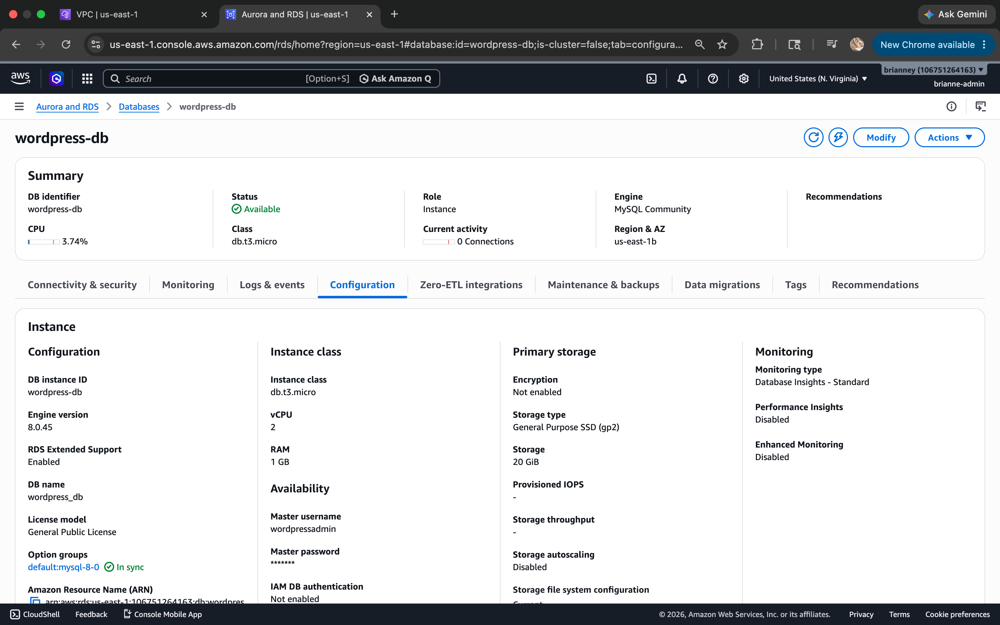

**ALB** — the Application Load Balancer is the single controlled entry point into the application. Nothing reaches EC2 without going through it first.

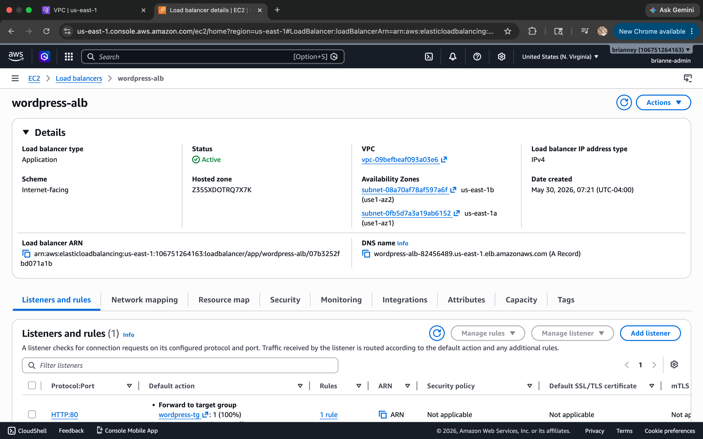

---

### Step 4 — Database Migration Simulation

In a real migration, data gets exported from the source server before the destination infrastructure is even provisioned. I created a sample SQL export file locally on my Mac to simulate that sequence: export first, then provision, then import.

The file was transferred to EC2 using SCP (Secure Copy Protocol), which uses the same key pair authentication as SSH. From inside the EC2 instance, I connected directly to the RDS endpoint using the MySQL client and ran the import, proving that EC2 can reach RDS through the security group chain and that the database is active and accepting connections.

---

### Step 5 — WordPress Installation and Database Connection

WordPress was installed and configured through the browser-based setup wizard using the RDS endpoint as the database host. WordPress created its own tables and initial data inside the managed RDS instance, confirming the full application to database connection was working end to end.

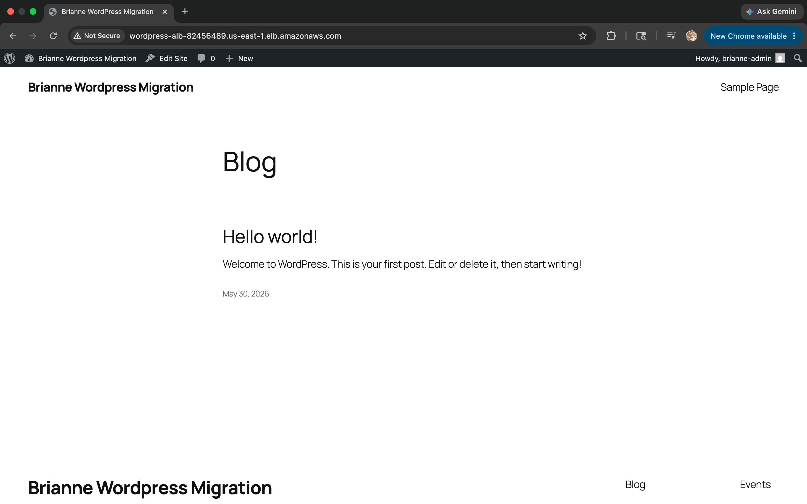

---

### Step 6 — Architecture Verification

Building the infrastructure is not enough. I ran five tests to confirm every security control is actually enforced and not just configured.

**Test 1: WordPress loads via the ALB URL**
The full traffic path is confirmed working. Internet to ALB to EC2 to WordPress to RDS.

**Test 2: Direct EC2 access is blocked**
Pasting the EC2 public IP directly into a browser produces a connection timeout. The EC2 security group accepts port 80 only from the ALB, not from the open internet.

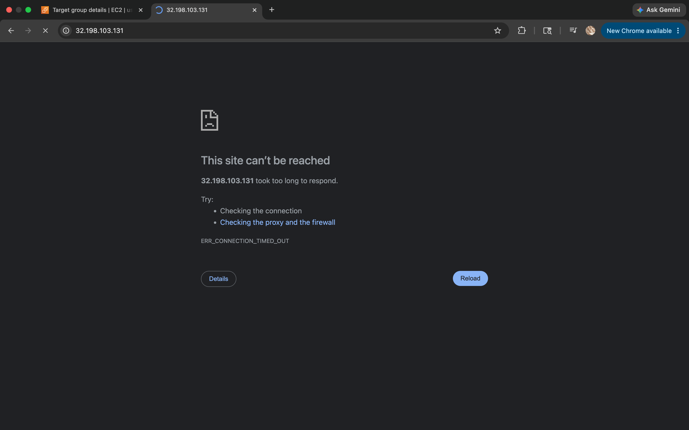

**Test 3: RDS is isolated in a private subnet**
Two layers of database protection are confirmed. publicly_accessible = false at the resource level, and private subnet placement with no internet gateway route. The only successful connection to RDS was made from EC2 through the security group chain.

**Test 4: ALB health check is passing**
The target group shows wordpress-server as Healthy, confirming the ALB is actively verifying EC2 is responding on port 80 before routing any traffic to it.

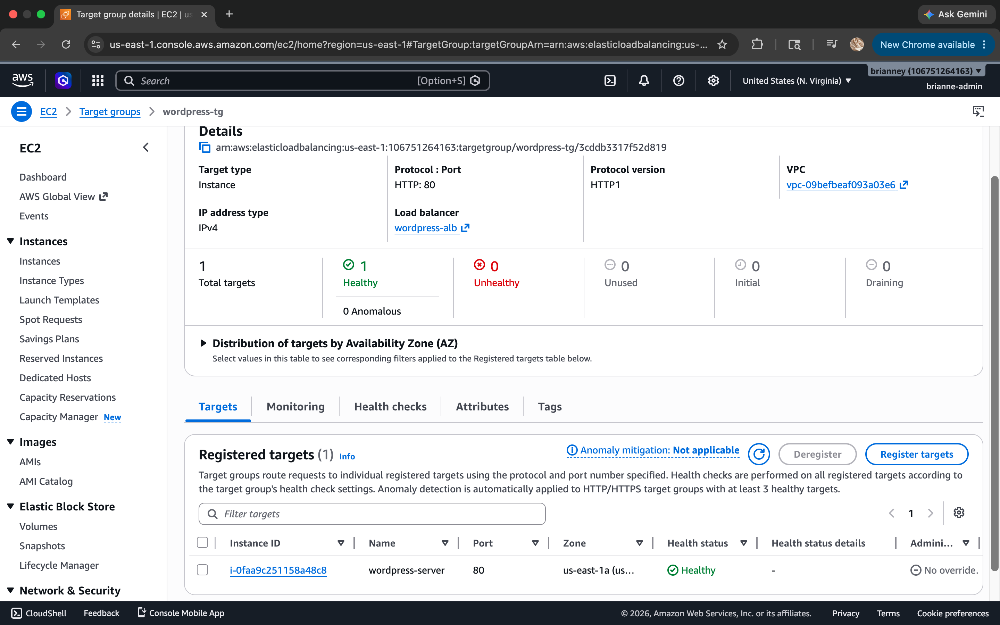

**Test 5: CloudWatch alarms are active**
Both alarms are confirmed. ec2-cpu-high watching CPU above 80% and rds-connections-high watching database connections above 50. Both fire SNS email alerts when thresholds are exceeded.

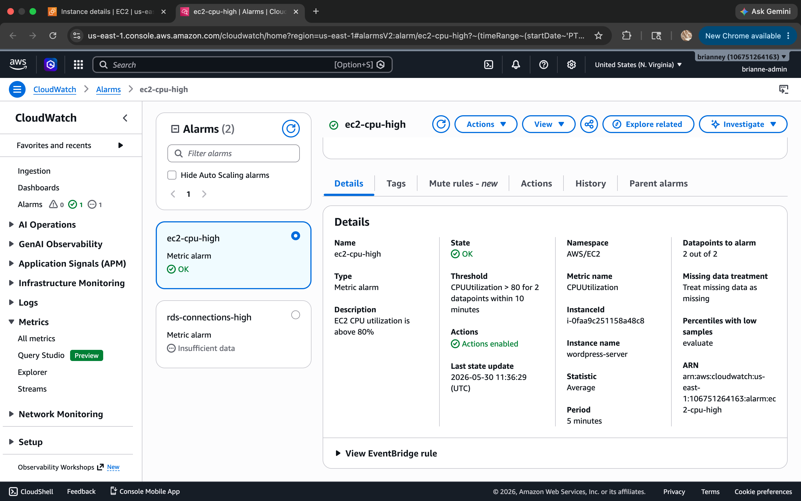

---

## Results — What the Working System Demonstrates

WordPress loads through the ALB DNS URL. Direct access to the EC2 public IP is blocked. The RDS database is unreachable from outside the VPC. CloudWatch alarms are active and monitoring both the application and database layers.

The entire infrastructure was provisioned from code with a single terraform apply command and can be fully torn down with a single terraform destroy. That reproducibility is the point of Infrastructure as Code.

---

## Troubleshooting — Real Issues Encountered and Resolved

**Issue 1 — EC2 had no public IP assigned**
After apply completed, ec2_public_ip came back empty. The browser was showing 502 Bad Gateway. The ALB health check was failing. Three different problems with one root cause: EC2 was launched without associate_public_ip_address = true. Without a public IP the ALB had no way to reach the instance, which cascaded into all three symptoms. I added that one line to the EC2 resource in main.tf and reran terraform apply. Terraform destroyed and recreated the instance with a public IP assigned and all three symptoms cleared at once.

**Issue 2 — WordPress never installed on EC2**
After SSH-ing into the instance and checking /var/log/cloud-init-output.log, I found the user_data script had failed with wget: command not found. Amazon Linux 2023 does not include wget by default. It uses curl. Apache and PHP had installed fine but WordPress was never downloaded, leaving the web server running with no content. I manually downloaded WordPress using curl, extracted the files into Apache's web directory, set correct file ownership using chown, and restarted Apache. WordPress loaded immediately after.

**Issue 3 — MySQL client unavailable on Amazon Linux 2023**
Running sudo yum install -y mysql returned No match for argument: mysql. Amazon Linux 2023 uses mariadb105 as the package name for MySQL compatible client tools. Installed that instead, which is fully compatible with RDS MySQL 8.0.

**Issue 4 — GitHub push rejected with 403 Forbidden**
The first push attempt failed with a 403. I had generated a fine-grained Personal Access Token instead of a classic token. Fine-grained tokens have stricter permission requirements that caused the rejection. I generated a new classic token scoped to repo only and the push succeeded.

**Issue 5 — Peer feedback on CloudWatch evaluation window**
After the build, a fellow cloud engineer reviewed the architecture and flagged that a 10-minute evaluation window on the CloudWatch alarms may be too slow for production use. In a real environment issues need to be caught within 1 to 2 minutes. The 10-minute window was intentional here to avoid false alarms during active building and testing, but in a production deployment this would be reduced significantly.

---

## Security Implementation Summary

| Layer | Control | Purpose |
|-------|---------|---------|
| VPC | Private subnets for RDS | Database has no route to the internet gateway |
| Security Group | ALB accepts port 80 from internet only | Single controlled entry point |
| Security Group | EC2 accepts port 80 from ALB only | Direct EC2 access is blocked |
| Security Group | EC2 accepts SSH from one IP only | Management access restricted to one machine |
| Security Group | RDS accepts port 3306 from EC2 only | Database unreachable from the internet |
| RDS | publicly_accessible = false | Enforced at the resource level regardless of subnet configuration |
| S3 | Block Public Access enabled | State file is never publicly exposed |
| Terraform | sensitive = true on db_password | Credentials never print in terminal output |
| Git | terraform.tfvars in .gitignore | Secrets are never committed to GitHub |

---

## Key Learnings

- Infrastructure as Code means the same stack can be deployed anywhere with one command. That reproducibility is what makes it valuable in a team environment.
- Security group chaining using security group IDs instead of IP ranges is more precise. The rule follows the resource automatically rather than breaking when an IP changes.
- Terraform state is the source of truth. It belongs in S3 for the same reason code belongs in GitHub. Local machines fail and single points of failure are a risk regardless of what is stored on them.
- The user_data script does not guarantee successful execution. Always check /var/log/cloud-init-output.log after launch. Never assume a script ran because the instance shows as running.
- Reading error messages carefully before taking action saved significant time on every issue I hit. Every problem in this build was solved by finding the actual root cause rather than treating the symptoms.

---

## Cleanup — Avoid Unnecessary AWS Charges

When you are done testing and exploring this project, clean up your AWS resources in the following order to avoid unexpected charges.

**Important:** Always run terraform destroy before touching the S3 state bucket. Deleting the state file before destroying the infrastructure leaves orphaned resources running in AWS with no way to track them.

1. Terminal → run terraform destroy → type yes when prompted → wait for completion
2. S3 → brianne-terraform-state-2026 → Empty bucket → confirm
3. S3 → brianne-terraform-state-2026 → Delete bucket → confirm
4. CloudWatch → Alarms → confirm all alarms were removed by terraform destroy
5. SNS → Topics → confirm topic was removed by terraform destroy

All EC2, RDS, ALB, VPC, and security group resources are removed automatically by terraform destroy.

---

## Let's Connect!

Brianne Young | Cloud Engineer | [LinkedIn](https://www.linkedin.com/in/brianne-young0/) | [GitHub](https://github.com/brianne-y)
